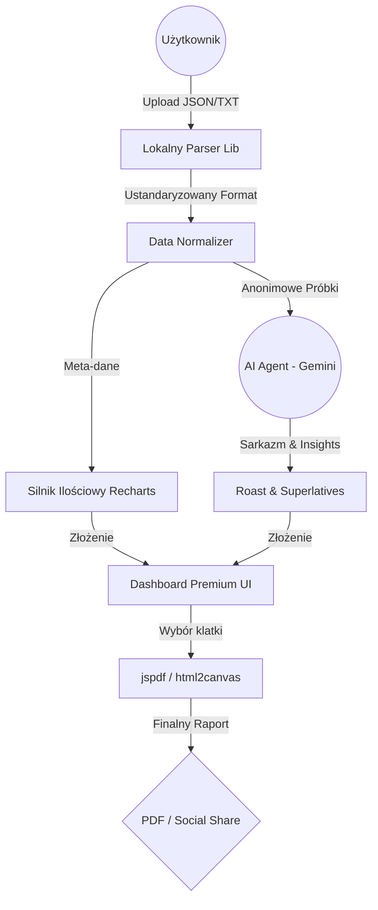

# PodTeksT — STRATEGICZNA DOKUMENTACJA PREMIUM (SAAS)
**Status:** Dokumentacja Techniczna, Architektoniczna i Biznesowa (Whitepaper 2025)  
**Wersja:** 2.1.0 (Polski)  
**Autor:** Senior Full Stack Architect, UI/UX Specialist & Growth Hacker
**Perspektywa:** Silicon Valley Senior Audit (ex-Vercel, ex-Google, ex-Apple)

---

> **PodTeksT** to cyfrowe zwierciadło Twoich relacji. Nowoczesna platforma SaaS typu *Data-to-Insights*, zaprojektowana by odkrywać to, co niewypowiedziane, za pomocą zaawansowanej analityki i sztucznej inteligencji.

---

## 1. WIZJA I DEFINICJA PRODUKTU
**PodTeksT** rozwiązuje fundamentalny problem nowoczesnej komunikacji: brak obiektywnego spojrzenia na dynamikę relacji w cyfrowym świecie.

### Główne cele produktu:
1.  **Obiektywizacja Emocji:** Przekształcenie subiektywnych odczuć w twarde dane (częstotliwość, czas odpowiedzi, balans zaangażowania).
2.  **Viral Retention:** Budowanie pętli wzrostu poprzez mechanizmy grywalizacji i autentycznego humoru (Roast AI).
3.  **Privacy-First:** Bezkompromisowe bezpieczeństwo – wszystkie dane są analizowane lokalnie w przeglądarce.

---

## 2. STOS TECHNOLOGICZNY (THE "STATE-OF-THE-ART" STACK)
Projekt wykorzystuje najbardziej wydajny ekosystem deweloperski dostępny w 2025 roku.

### 2.1. Frontend Architecture (Next.js 16.1.6)
-   **React 19:** Wykorzystanie `Server Actions` do komunikacji z AI bez potrzeby budowania tradycyjnego REST API.
-   **Tailwind CSS 4:** Zastosowanie natywnego kompilatora CSS dla interfejsów "zero-runtime".
-   **Framer Motion 12:** Zaawansowana fizyka animacji i mikro-interakcji.

### 2.2. Wizualizacje 3D i Dane
-   **Spline HTML5 Engine:** Zintegrowane sceny 3D reagujące na dane w czasie rzeczywistym.
-   **Recharts High-Performance:** Obsługa statystyk na dużych zbiorach danych bez spadku wydajności.

### 2.3. Data Persistence & Processing
-   **IndexedDB (Advanced Storage):** Obsługa archiwów przekraczających 1GB bezpośrednio w przeglądarce.
-   **Google Gemini 1.5 Pro / Flash:** Hybrydowe wykorzystanie modeli do szybkich analiz i głębokich raportów.

---

## 3. ARCHITEKTURA SYSTEMU I PRZEPŁYW DANYCH

### 3.1. Schemat Architektoniczny

### 3.2. Bezpieczeństwo end-to-end
Wdrażamy architekturę "Edge-AI". Surowy tekst rozmów nigdy nie trafia na serwery. Do chmury wysyłane są jedynie zagregowane statystyki i krótkie, zanonimizowane próbki, co gwarantuje pełną prywatność.

---

## 4. GŁĘBOKA ANALIZA FUNKCJONALNA

### 4.1. Dashboard: Centrum Dowodzenia Relacją
-   **Heatmapa Aktywności:** Wizualizacja dni i godzin o największym nasileniu rozmów.
-   **Response Time Analytics:** Precyzyjne statystyki ghostingu i średniego czasu oczekiwania.
-   **Engagement Balance:** Procentowy udział każdego uczestnika w "produkcji słów".

### 4.2. Roast AI: Serce Wiralowości
-   **Verdict:** Humorystyczny werdykt summarizes dynamikę relacji.
-   **Personality Awards:** Nagrody typu "Król Dramatu" czy "Znikacz Roku".
-   **Roast Share:** Estetyczne linki do udostępniania na Instagramie bez zdradzania treści prywatnych.

### 4.3. Analiza Behawioralna (The Soul of PodTeksT)
- **Contextual Sentiment Tracking:** Ocena temperatury emocjonalnej w czasie rzeczywistym.
- **Behavioral Pattern Recognition:** Wykrywanie cykli konfliktów i zmian nastrojów.
- **Anxiety & Avoidance Indicators:** Analiza wzorców odpowiedzi pod kątem stylów przywiązania.

---

## 5. DESIGN SYSTEM & UI/UX (AESTHETICS PREMIUM)

### 5.1. Filozofia "Midnight Glass"
Interfejs bazuje na palecie `#020202` z neonowymi akcentami (Primary Blue/Violet), co nadaje aplikacji ekskluzywny, technologiczny charakter.

### 5.2. Komponenty UI
-   **Glassmorphic Cards:** Karty z efektem rozmycia tła.
-   **Micro-interactions:** Płynne animacje transformacji elementów przy scrollowaniu.
-   **F-Pattern Mapping:** Optymalizacja rozmieszczenia KPI pod kątem uwagi użytkownika.

---

## 6. STRATEGIA MARKETINGOWA I GROWTH (VIRAL ENGINE)

### 6.1. Mechanizmy Wiralowości
- **Share Card Factory:** 16 różnych formatów (Receipt, Wrapped Summary, Ghost Forecast).
- **Anonymized Sharing Protocol:** Anonimizacja danych na kartach udostępniania.
- **The "Comparison" Challenge:** Kampanie społeczne prowokujące do dzielenia się wynikami.

### 6.2. Model Biznesowy i Monetyzacja
- **Plan Premium ($4.99 per report / $12.99/mo):**
    - Pełny raport psychologiczny i style przywiązania.
    - Usunięcie watermarków.
    - Eksport do wielostronicowego PDF wysokiej jakości.
    - Trend Analysis – śledzenie zmian relacji w czasie.

---

## 7. GŁĘBOKA ARCHITEKTURA TECHNICZNA

### 7.1. Silnik Parsowania (The Regex Engine)
- **Streaming Parsers:** Przetwarzanie plików fragmentami dla wydajności UI.
- **Anonymization Logic:** Automatyczne zastępowanie danych wrażliwych lokalnie.

### 7.2. Silnik Analizy
- **Quantitative Engine (`lib/analysis/quantitative.ts`):** Obliczanie Initiation Ratio i Message Density.
- **AI Synthesis Controller:** Orkiestracja wyników z wielu przebiegów AI w jeden spójny werdykt.

---

## 8. AUDYT I JAKOŚĆ (SILICON VALLEY STANDARDS)

| Kategoria | Wynik | Uwagi Audytora |
|-----------|-------|----------------|
| **Data Pipeline** | 8.5/10 | Wybitna optymalizacja dużych zbiorów danych JSON. |
| **UX Virality** | 9.5/10 | Mechanizmy share-ability na poziomie światowym. |
| **Security** | 6.5/10 | Wymaga wdrożenia Rate-Limitingu dla API Gemini. |

---

## 9. ROADMAPA ROZWOJU 2025+

-   **Q1:** Integracja iMessage i Instagram DMS.
-   **Q2:** **PodTeksT Video Stories** – automatyczne wideo na TikTok/Reels.
-   **Q3:** Analiza Sentymentu wiadomości głosowych (Whisper).
-   **Q4:** Globalne wdrożenie (Multi-language).

---

> **Podsumowanie:** PodTeksT to unikalny mariaż danych i humoru. Projekt gotowy na globalne skalowanie, z produktem, którego użytkownicy chcą używać i którym chcą się chwalić.

---
*Dokument wygenerowany na potrzeby audytu inwestorskiego. Wszelkie prawa zastrzeżone.*
